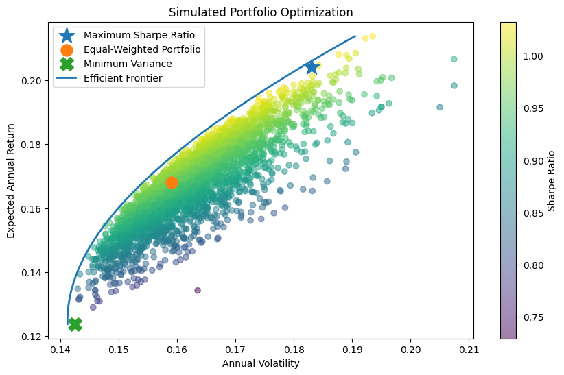

# Portfolio Optimization using Python

This project implements Modern Portfolio Theory (MPT) to analyze optimal portfolio allocation using historical stock data.

## Overview

The project combines Monte Carlo simulation and mean-variance optimization to study the trade-off between risk and return.

## Methods

- Monte Carlo simulation of random portfolios
- Maximum Sharpe ratio portfolio
- Minimum variance portfolio
- Efficient frontier using constrained optimization

## Results

- Identified the portfolio with the highest risk-adjusted return (Sharpe ratio)
- Compared equal-weighted and optimized portfolios
- Visualized the efficient frontier and simulated portfolios

## Technologies Used

- Python
- NumPy
- Pandas
- Matplotlib
- SciPy
- yFinance

## Visualization

